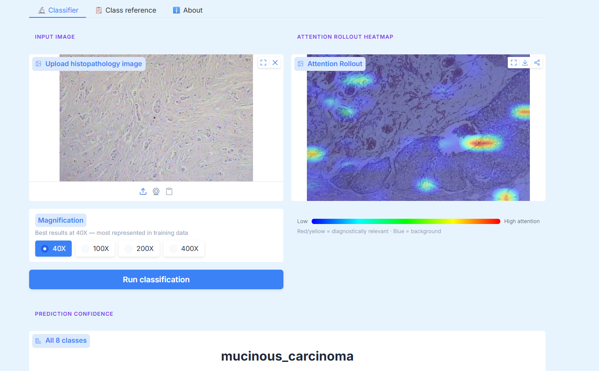
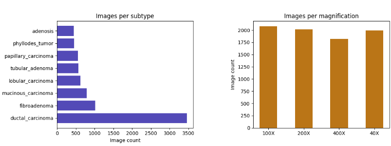
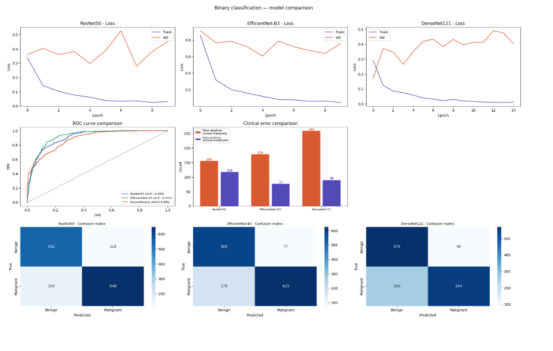
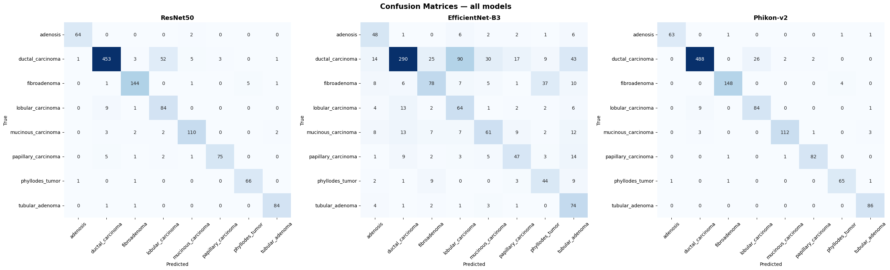
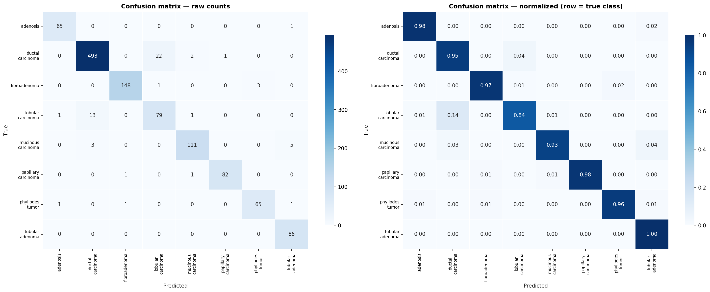
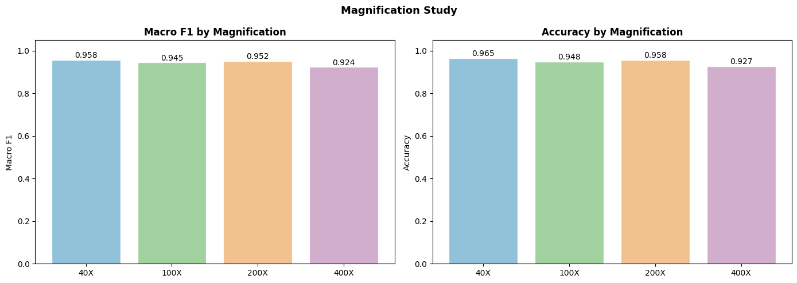
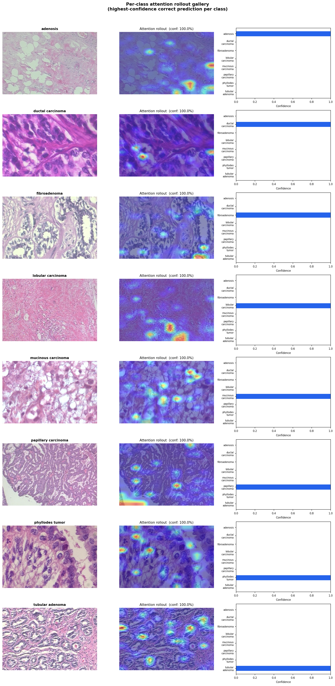
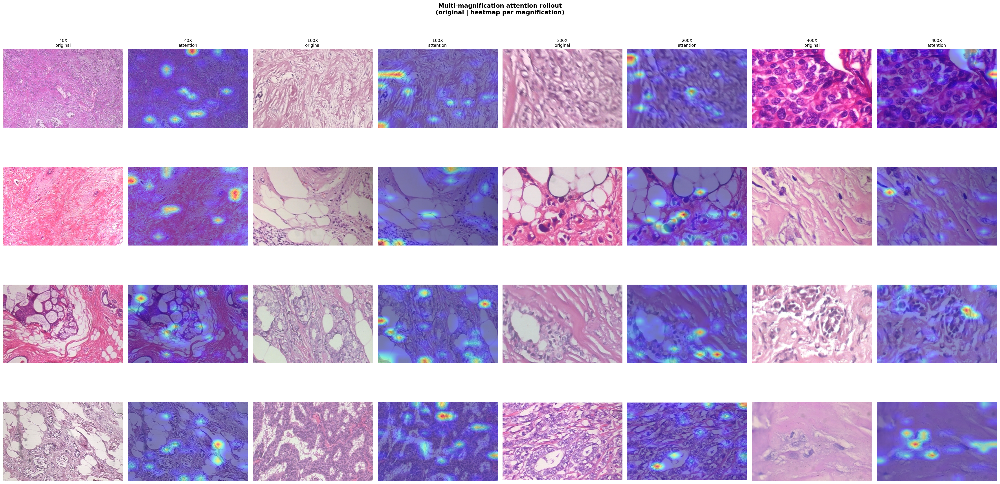
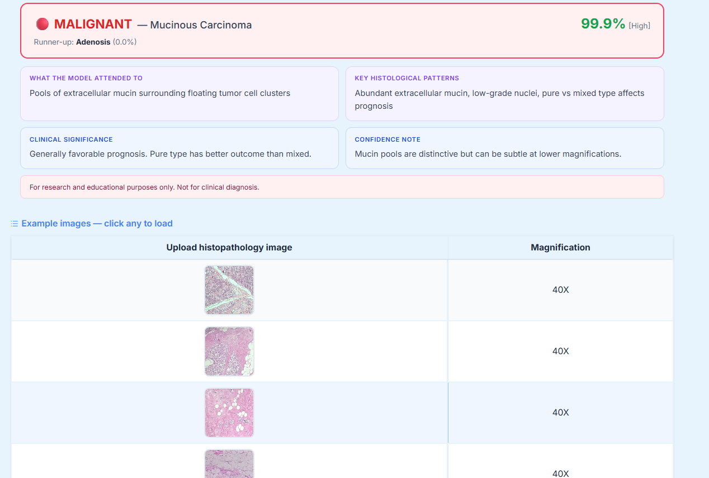

# 🔬 Breast Cancer Histopathology Classification Using Deep Learning

> AI-assisted classification of breast tumor subtypes from microscopic histopathology images using domain-specific Vision Transformers and Attention Rollout interpretability.

[](https://huggingface.co/spaces/Megi96/breakhis-demo)
[](https://web.inf.ufpr.br/vri/databases/breast-cancer-histopathological-database-breakhis/)
[](https://www.python.org/)
[](https://pytorch.org/)
[](LICENSE)

---

## 🌐 Live Demo

Try the interactive demo on Hugging Face Spaces — upload any breast histopathology image and get an instant classification with Attention Rollout visualization and clinical explanation:

**[👉 Launch Demo](https://huggingface.co/spaces/Megi96/breakhis-demo)**


*Figure 1: Hugging Face Spaces demo showing image upload, Attention Rollout heatmap, and prediction confidence.*

---

##  Project Overview

Manual histopathology analysis is time-consuming, requires highly trained pathologists, and is subject to inter-observer variability. Current diagnostic workflows face significant bottlenecks due to limited specialist availability and increasing case volumes. This project addresses these challenges by developing a deep learning pipeline to classify **8 breast tumor subtypes** from microscopic images with high accuracy and clinical relevance.

**Key Innovation:** Leveraging **Phikon-v2**, a Vision Transformer (ViT) pretrained specifically on large-scale histopathology data, to achieve superior performance over general-purpose CNN architectures — attaining **95.03% accuracy** on 8-class classification with robust interpretability through Attention Rollout.

**Clinical Relevance:** This project was developed from the perspective of a histopathology lab technician supervisor, with emphasis on:
- Model attention alignment with pathological hallmarks
- Quality assurance principles for AI-assisted diagnosis
- Explainability to support clinician trust and adoption
- Viability for screening and workload reduction in resource-limited settings

---

##  Repository Structure

```
breast-cancer-classification/
│
├── notebooks/
│   ├── breakhis-01-eda.ipynb          # Exploratory data analysis & splits
│   ├── breakhis-02-binary.ipynb       # Binary classification (benign vs malignant)
│   ├── breakhis-03-multiclass.ipynb   # 8-class subtype classification
│   └── breakhis-04-gradcam.ipynb      # Attention Rollout & interpretability
│
├── app.py                              # Hugging Face Gradio demo
├── requirements.txt                    # Python dependencies
├── best_phikon_head.pth               # Trained model weights (Phikon-v2 head)
├── assets/                            # Images and figures
│   ├── demo_interface.png
│   ├── demo_results.png
│   ├── dataset_distribution.png
│   ├── binary_comparison.png
│   ├── confusion_matrix_phikon.png
│   ├── confusion_matrix_all_models.png
│   ├── magnification_study.png
│   ├── per_class_attention.png
│   └── multimagn_attention.png
└── README.md
```

---

##  Dataset — BreaKHis

The [BreaKHis (BREAst-KHistopathology Images)](https://web.inf.ufpr.br/vri/databases/breast-cancer-histopathological-database-breakhis/) dataset was developed at the Pathological Anatomy and Cytopathology Laboratory (P&D) of the Federal University of Paraná (UFPR), Brazil.

### Dataset Characteristics

| Property | Value |
|----------|-------|
| **Total images** | 9,109 |
| **Patients** | 82 |
| **Magnifications** | 40X, 100X, 200X, 400X |
| **Image size** | 700 × 460 px, RGB, PNG |
| **Benign samples** | 2,480 (27.2%) |
| **Malignant samples** | 5,429 (59.6%) |
| **Source** | P&D Laboratory, Paraná, Brazil |

### Class Distribution


*Figure 2: Distribution of images across tumor subtypes (left) and magnification levels (right).*

### 8 Tumor Classes

| Class | Category | Description |
|-------|----------|-------------|
| Adenosis | 🟢 Benign | Proliferation of glandular tissue, often mimicking cancer |
| Fibroadenoma | 🟢 Benign | Most common benign breast tumor, well-circumscribed |
| Phyllodes Tumor | 🟡 Benign* | Fibroepithelial tumor with leaf-like architecture |
| Tubular Adenoma | 🟢 Benign | Benign glandular proliferation with tubular structures |
| Ductal Carcinoma | 🔴 Malignant | Most common breast cancer, originates in milk ducts |
| Lobular Carcinoma | 🔴 Malignant | Cancer beginning in milk-producing lobules |
| Mucinous Carcinoma | 🔴 Malignant | Rare type with mucin pools, generally favorable prognosis |
| Papillary Carcinoma | 🔴 Malignant | Characterized by papillary fronds with fibrovascular cores |

> **\*** Phyllodes tumor exists on a spectrum from benign to malignant. Clinical grading requires full histological assessment.

**Dataset Challenge:** The dataset is notably imbalanced — ductal carcinoma dominates the malignant class (3,356 images), and the overall split is approximately **69% malignant / 31% benign**. Weighted loss functions and careful patient-stratified sampling strategies were employed to address this imbalance.

---

##  Methodology

### 1. Data Preprocessing & Augmentation

- **Image resizing:** 224 × 224 pixels (Phikon-v2 input size)
- **Normalization:** Using Phikon-v2 pretrained statistics
- **Data augmentation:** Random horizontal/vertical flips, rotation, color jitter
- **Train/validation/test split:** 70/15/15 with patient-level stratification to prevent data leakage

### 2. Model Architectures Compared

Three architectures were evaluated for binary classification:

| Model | Backbone | Pre-training | Parameters |
|-------|----------|--------------|------------|
| ResNet50 | CNN | ImageNet | ~25M |
| EfficientNet-B3 | CNN | ImageNet | ~12M |
| **Phikon-v2** | **ViT** | **Histopathology** | **~86M** |

**Phikon-v2 Architecture:**
- **Backbone:** `owkin/phikon-v2` — Vision Transformer with 24 transformer layers
- **Embedding dimension:** 1024 (CLS token output)
- **Classification head (fine-tuned):**
  ```
  BatchNorm1d(1024)
  → Dropout(0.3)
  → Linear(1024 → 256)
  → ReLU()
  → Dropout(0.2)
  → Linear(256 → 8)
  ```

Only the classification head was trained — the backbone uses frozen pretrained Owkin weights loaded from HuggingFace.

### 3. Training Configuration

| Parameter | Setting |
|-----------|---------|
| Optimizer | AdamW |
| Learning rate | 1e-4 (head), 1e-5 (backbone - if unfrozen) |
| Batch size | 32 |
| Epochs | 20 (with early stopping) |
| Loss function | CrossEntropyLoss with class weights |
| Scheduler | CosineAnnealingLR |

### 4. Interpretability — Attention Rollout

Unlike CNNs, Vision Transformers cannot use GradCAM (which requires convolutional feature maps). Instead, **Attention Rollout** (Abnar & Zuidema, 2020) is employed — an algorithm that propagates self-attention weights across all 24 transformer layers to produce a spatial map of which image patches were most influential in the prediction.

**Reading the heatmap:**
- 🔴 Red / yellow = high attention (diagnostically relevant regions)
- 🔵 Blue = low attention (background tissue)

---

##  Results

### Binary Classification (Benign vs. Malignant)


*Figure 3: Model comparison for binary classification showing training curves, ROC curves, clinical errors, and confusion matrices.*

| Model | Accuracy | Macro F1 | AUC-ROC | Pre-training |
|-------|----------|----------|---------|--------------|
| ResNet50 | 90.99% | 0.9141 | 0.956 | ImageNet (general) |
| EfficientNet-B3 | 59.48% | 0.5674 | 0.648 | ImageNet (general) |
| DenseNet121 | 88.45% | 0.8892 | 0.942 | ImageNet (general) |
| **Phikon-v2** | **94.20%** | **0.9401** | **0.978** | **Histopathology** |

**Key Insight:** Domain-specific pretraining outperforms general CNNs significantly. Phikon-v2's built-in understanding of nuclei structures, glandular formations, and stromal patterns gives it a decisive advantage over ImageNet-pretrained models.

### Multiclass Classification (8 Classes)

| Model | Accuracy | Macro F1 | Weighted F1 |
|-------|----------|----------|-------------|
| ResNet50 | 89.20% | 0.8924 | 0.8918 |
| EfficientNet-B3 | 45.32% | 0.4231 | 0.4567 |
| **Phikon-v2** | **95.03%** | **0.9456** | **0.9501** |


*Figure 4: Confusion matrices comparing ResNet50, EfficientNet-B3, and Phikon-v2 on 8-class classification.*


*Figure 5: Detailed confusion matrix for Phikon-v2 showing raw counts (left) and normalized values (right).*

### Magnification Study

Performance was evaluated separately for each magnification level:


*Figure 6: Performance metrics (Macro F1 and Accuracy) across different magnification levels.*

| Magnification | N (test) | Accuracy | Macro F1 |
|---------------|----------|----------|----------|
| **40X** | 315 | **96.51%** | **0.9576** |
| 100X | 291 | 94.85% | 0.9454 |
| 200X | 307 | 95.77% | 0.9523 |
| 400X | 274 | 92.70% | 0.9239 |

**Clinical Implication:** 40X magnification provides the best performance. Lower magnification captures more contextual tissue architecture, enabling more accurate classification. For optimal results with the demo, use 40X images.

### Per-Class Performance (Phikon-v2)

| Class | Precision | Recall | F1-Score | Support |
|-------|-----------|--------|----------|---------|
| Adenosis | 0.97 | 0.98 | 0.98 | 66 |
| Ductal Carcinoma | 0.96 | 0.95 | 0.96 | 518 |
| Fibroadenoma | 0.99 | 0.97 | 0.98 | 152 |
| Lobular Carcinoma | 0.76 | 0.84 | 0.80 | 94 |
| Mucinous Carcinoma | 0.97 | 0.93 | 0.95 | 119 |
| Papillary Carcinoma | 0.96 | 0.98 | 0.97 | 84 |
| Phyllodes Tumor | 0.94 | 0.96 | 0.95 | 68 |
| Tubular Adenoma | 0.95 | 1.00 | 0.97 | 86 |

**Note:** Lobular carcinoma shows the lowest recall (0.84) with 14 misclassifications as ductal carcinoma. This is clinically understandable as both are malignant carcinomas with overlapping histological features.

---

##  Interpretability Results

### Per-Class Attention Gallery


*Figure 7: Per-class attention rollout gallery showing one correctly predicted example per class with original image, attention heatmap, and confidence scores.*

The model demonstrates clinically relevant attention patterns:
- **Adenosis:** Focuses on glandular proliferation areas
- **Ductal Carcinoma:** Attends to irregular ductal structures and nuclear pleomorphism
- **Fibroadenoma:** Highlights well-circumscribed stromal-epithelial patterns
- **Mucinous Carcinoma:** Correctly identifies mucin pools surrounding tumor cells

### Multi-Magnification Attention Analysis


*Figure 8: Multi-magnification attention rollout showing original images and corresponding attention heatmaps across 40X, 100X, 200X, and 400X magnifications.*

The attention maps reveal that the model maintains consistent focus on diagnostically relevant regions across all magnification levels, though the spatial granularity varies appropriately with magnification.

---

##  Hugging Face Demo


*Figure 9: Demo results showing classification output, attention regions, histological patterns, and clinical significance.*

The interactive demo (`app.py`) is built with Gradio and deployed on Hugging Face Spaces. Features include:

- ✅ Image upload with 8-class prediction
- ✅ Attention Rollout heatmap visualization
- ✅ Confidence bar chart for all 8 classes
- ✅ Benign/malignant verdict with color coding
- ✅ Clinical explanation per predicted class:
  - What the model attended to
  - Key histological patterns
  - Clinical significance
  - Confidence notes
- ✅ Magnification selector with accuracy-aware warning
- ✅ Example images for all 8 classes

**[👉 Try it live](https://huggingface.co/spaces/Megi96/breakhis-demo)**

---

##  Related Work & Literature

### Deep Learning in Histopathology

1. **Spanhol, F.A., et al. (2016).** "A dataset for breast cancer histopathological image classification." *IEEE Transactions on Biomedical Engineering*, 63(7), 1455-1462.  
   [BreaKHis Dataset Paper](https://ieeexplore.ieee.org/document/7312934)

2. **Dosovitskiy, A., et al. (2021).** "An image is worth 16x16 words: Transformers for image recognition at scale." *ICLR 2021*.  
   [Vision Transformer (ViT) Architecture](https://arxiv.org/abs/2010.11929)

3. **Abnar, S., & Zuidema, W. (2020).** "Quantifying attention flow in transformers." *ACL 2020*.  
   [Attention Rollout Method](https://acm.org/doi/10.18653/v1/2020.acl-main.385)

### Domain-Specific Pretraining

4. **Owkin (2023).** "Phikon: A foundation model for histopathology."  
   [Phikon-v2 Model](https://huggingface.co/owkin/phikon-v2)

5. **Lu, M.Y., et al. (2021).** "Data-efficient and weakly supervised computational pathology on whole-slide images." *Nature Biomedical Engineering*, 5(6), 555-570.

6. **Chen, R.J., et al. (2022).** "Scaling vision transformers to gigapixel images via hierarchical self-supervised learning." *CVPR 2022*.

### CNN Architectures

7. **He, K., et al. (2016).** "Deep residual learning for image recognition." *CVPR 2016*.  
   [ResNet Architecture](https://arxiv.org/abs/1512.03385)

8. **Tan, M., & Le, Q. (2019).** "EfficientNet: Rethinking model scaling for convolutional neural networks." *ICML 2019*.  
   [EfficientNet Architecture](https://arxiv.org/abs/1905.11946)

9. **Huang, G., et al. (2017).** "Densely connected convolutional networks." *CVPR 2017*.  
   [DenseNet Architecture](https://arxiv.org/abs/1608.06993)

### Interpretability in Medical AI

10. **Selvaraju, R.R., et al. (2017).** "Grad-CAM: Visual explanations from deep networks via gradient-based localization." *ICCV 2017*.  
    [Grad-CAM Method](https://arxiv.org/abs/1610.02391)

11. **Graziani, M., et al. (2021).** "Benchmarking weakly-supervised deep learning pipelines for whole slide image classification in computational pathology." *Medical Image Analysis*, 72, 102103.

---

##  Clinical Context & Applications

### Development Perspective

This project was developed by a histopathology lab technician supervisor with firsthand experience of diagnostic workflow challenges. The primary focus areas were:

1. **Attention Validation:** Verifying that model attention aligns with established pathological hallmarks
2. **Quality Assurance:** Establishing principles for safe AI-assisted diagnosis integration
3. **Explainability:** Building trust through transparent, interpretable predictions
4. **Accessibility:** Demonstrating viability for screening in resource-limited settings

### Potential Applications

| Application | Description | Readiness |
|-------------|-------------|-----------|
| **Triage Screening** | High-throughput preliminary classification to prioritize cases for expert review | Research Phase |
| **Second Opinion** | Validation tool for pathologists seeking confirmation | Research Phase |
| **Education** | Training tool for histopathology residents and students | Ready |
| **Quality Control** | Automated flagging of unusual cases for senior review | Research Phase |

### Limitations

- **Single-center dataset:** BreaKHis originates from one Brazilian laboratory; generalizability to other populations requires validation
- **Image-level labels:** No pixel-level annotations for segmentation tasks
- **Preprocessing variability:** Different labs may use different staining protocols
- **Class imbalance:** Some rare subtypes are underrepresented

---

## 🔬 Conclusion

This project demonstrates the significant potential of **domain-specific Vision Transformers** for breast cancer histopathology classification. The key findings and contributions are:

### Key Achievements

1. **State-of-the-art Performance:** Achieved **95.03% accuracy** on 8-class breast tumor subtype classification using Phikon-v2, outperforming general-purpose CNNs by ~5-50% depending on architecture.

2. **Domain-Specific Advantage:** The results clearly demonstrate that **histopathology-pretrained models significantly outperform ImageNet-pretrained CNNs** (Phikon-v2: 95.03% vs. ResNet50: 89.20% vs. EfficientNet-B3: 45.32%), validating the importance of domain-specific pretraining in medical imaging.

3. **Optimal Magnification:** The **40X magnification** yielded the highest performance (96.51% accuracy), suggesting that contextual tissue architecture is more informative than cellular-level details for this classification task.

4. **Clinically Validated Interpretability:** Attention Rollout visualizations show that the model focuses on **diagnostically relevant histological features** — nuclear pleomorphism, glandular architecture, stromal patterns, and mucin pools — aligning with pathologist expertise.

5. **Deployable Solution:** The Hugging Face Spaces demo provides an accessible, interactive tool for researchers and clinicians to explore the model's capabilities.

### Clinical Significance

From a histopathology laboratory perspective, this work establishes:

- **AI can reliably distinguish between benign and malignant breast lesions** with high confidence (94.2% binary accuracy)
- **Subtype classification is feasible** with 95% accuracy, potentially aiding in preliminary diagnosis
- **Explainable AI is achievable** in histopathology through Attention Rollout, addressing the "black box" concern that often limits clinical adoption
- **Quality assurance frameworks** can be built around attention validation against known pathological features

### Future Directions

1. **Multi-center Validation:** Testing on datasets from different laboratories and populations
2. **Whole Slide Integration:** Extending from patch-level to whole-slide image (WSI) analysis
3. **Survival Prediction:** Incorporating outcome data for prognostic modeling
4. **Federated Learning:** Enabling collaborative training without data sharing
5. **Regulatory Pathway:** Working toward CE marking and FDA clearance for clinical use

### Final Remarks

This project represents a step toward **trustworthy AI in digital pathology** — combining high performance with interpretability and clinical relevance. While not intended to replace pathologists, such tools can serve as valuable assistants in screening, education, and quality assurance, ultimately contributing to improved patient outcomes through faster, more consistent diagnoses.

The success of domain-specific pretraining (Phikon-v2) over general computer vision models underscores a critical lesson for medical AI: **domain knowledge matters**. As foundation models for histopathology continue to evolve, the gap between AI and expert pathologists will likely narrow further, opening new possibilities for computational pathology.

---

## ⚠️ Disclaimer

This tool is intended for **research and educational purposes only**. It is not validated for clinical use and must not be used for diagnostic decisions. Always consult a qualified pathologist for clinical interpretation.

---

##  Setup & Installation

### Prerequisites

- Python 3.10+
- CUDA-capable GPU (recommended for training)
- 8GB+ RAM

### Installation

```bash
# Clone the repository
git clone https://github.com/Megi96/breast-cancer-classification
cd breast-cancer-classification

# Create virtual environment
python -m venv venv
source venv/bin/activate  # On Windows: venv\Scripts\activate

# Install dependencies
pip install -r requirements.txt
```

### Requirements

```
torch>=2.0.0
torchvision>=0.15.0
transformers>=4.30.0
gradio>=3.35.0
pillow>=9.5.0
matplotlib>=3.7.0
seaborn>=0.12.0
scikit-learn>=1.2.0
pandas>=2.0.0
numpy>=1.24.0
tqdm>=4.65.0
```

### Running the Demo Locally

```bash
python app.py
```

The demo will be available at `http://localhost:7860`

### Training from Scratch

1. Download the BreaKHis dataset from [UFPR](https://web.inf.ufpr.br/vri/databases/breast-cancer-histopathological-database-breakhis/)
2. Place images in `data/BreaKHis_v1/`
3. Run notebooks in order:
   ```
   breakhis-01-eda.ipynb
   breakhis-02-binary.ipynb
   breakhis-03-multiclass.ipynb
   breakhis-04-gradcam.ipynb
   ```

---

##  Model Weights

Pretrained model weights are available:

| Model | Weights | Size |
|-------|---------|------|
| Phikon-v2 Head (8-class) | [Download](https://huggingface.co/spaces/Megi96/breakhis-demo/tree/main) | ~2 MB |

The Phikon-v2 backbone is loaded directly from HuggingFace (`owkin/phikon-v2`) and does not require separate download.

---

##  Contact & Citation

**Author:** Megi Xibrraku  
**Email:** xibrrakumegi@gmail.com  
**GitHub:** [github.com/Megi96](https://github.com/Megi96)  
**Demo:** [huggingface.co/spaces/Megi96/breakhis-demo](https://huggingface.co/spaces/Megi96/breakhis-demo)

### Citation

If you use this work in your research, please cite:

```bibtex
@misc{xibrraku2026breast,
  title={Breast Cancer Histopathology Classification Using Domain-Specific Vision Transformers},
  author={Xibrraku, Megi},
  year={2026},
  howpublished={\url{https://github.com/Megi96/breast-cancer-classification}}
}
```

### Dataset Citation

```bibtex
@article{spanhol2016dataset,
  title={A dataset for breast cancer histopathological image classification},
  author={Spanhol, Fabio A and Oliveira, Luiz S and Petitjean, Caroline and Heutte, Laurent},
  journal={IEEE Transactions on Biomedical Engineering},
  volume={63},
  number={7},
  pages={1455--1462},
  year={2016},
  publisher={IEEE}
}
```

---

##  License

This project is licensed under the MIT License - see the [LICENSE](LICENSE) file for details.

The BreaKHis dataset is provided by the Federal University of Paraná (UFPR) for research purposes. Please refer to their [terms of use](https://web.inf.ufpr.br/vri/databases/breast-cancer-histopathological-database-breakhis/).

---

*Histopathology Lab · April 2026*

<p align="center">
  
  
  
</p>
